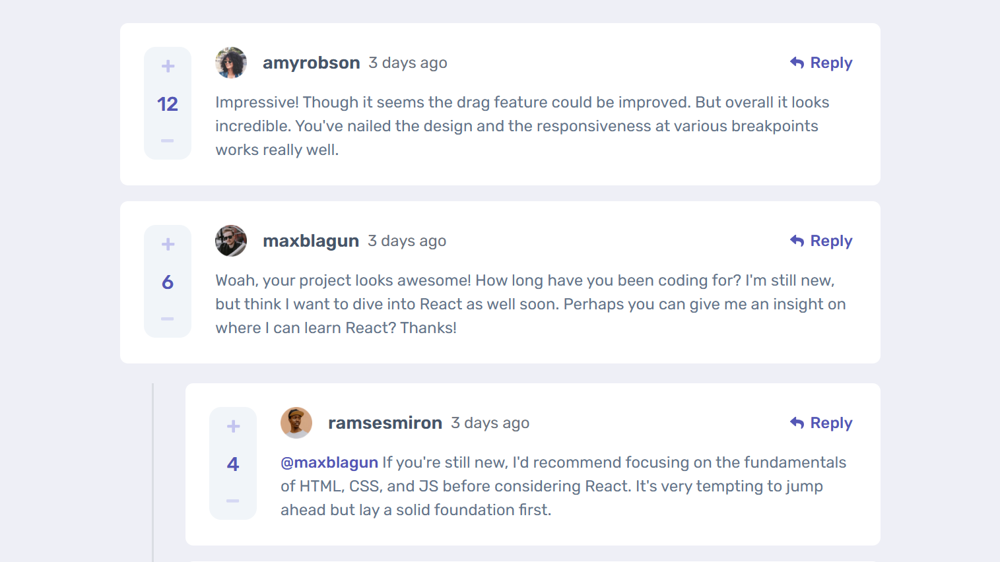

# Frontend Mentor - Interactive comments section solution

This is a solution to the [Interactive comments section challenge on Frontend Mentor](https://www.frontendmentor.io/challenges/interactive-comments-section-iG1RugEG9). The challenge is solved with the Next JS and Prisma (ORM). This was a nice challenge to demonstrate my skills as a full-stack developer. In this challenge, I never used API routes to mutate the database. All data mutations on the backend side have been handled through the Next JS server action.

## Table of contents

- [Overview](#overview)
  - [The challenge](#the-challenge)
  - [Screenshot](#screenshot)
  - [Links](#links)
  - [Built with](#built-with)
- [Author](#author)

## Overview

### The challenge

Users should be able to:

- View the optimal layout for the app depending on their device's screen size
- See hover states for all interactive elements on the page
- Create, Read, Update, and Delete comments and replies
- Upvote and downvote comments

### Screenshot

### Links

- Solution: [URL](https://www.frontendmentor.io/solutions/interactive-comments-section-with-next-js-a-react-framework-AzerPuDNoe)
- Live Site: [URL](https://interactive-comments-segment.netlify.app)

### Built with

- Semantic HTML5 markup
- CSS Grid
- Mobile-first workflow
- [React](https://reactjs.org/) - JS library
- [Next.js](https://nextjs.org/) - React framework
- [Tailwind CSS](https://tailwindcss.com/) - For styles
- [Prisma ORM](https://www.prisma.io/) - For managing database

## Author

- Website - [Junayed Akbor](https://junayedakbor.vercel.app/)
- Frontend Mentor - [@junayedakbor](https://www.frontendmentor.io/profile/junayed-code)
- Linkedin - [@junayedakbor](https://www.linkedin.com/in/junayedakbor/)
